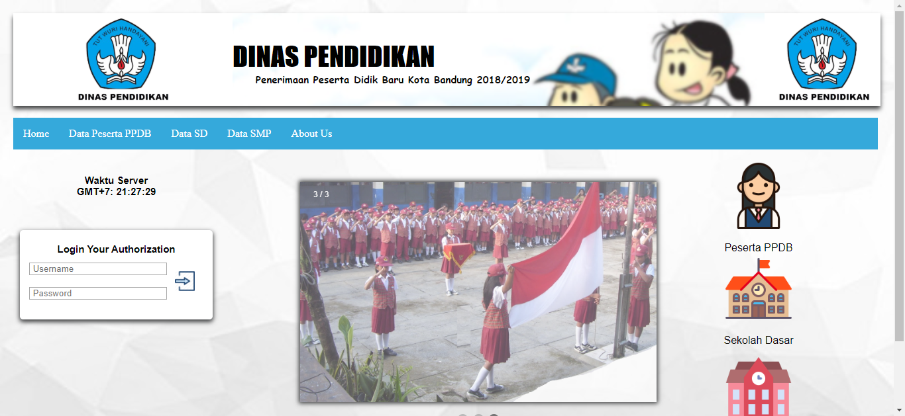
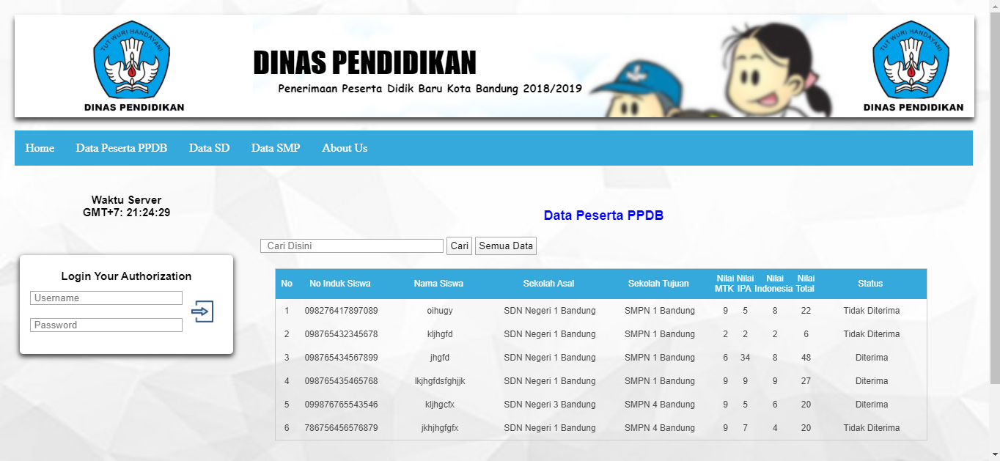
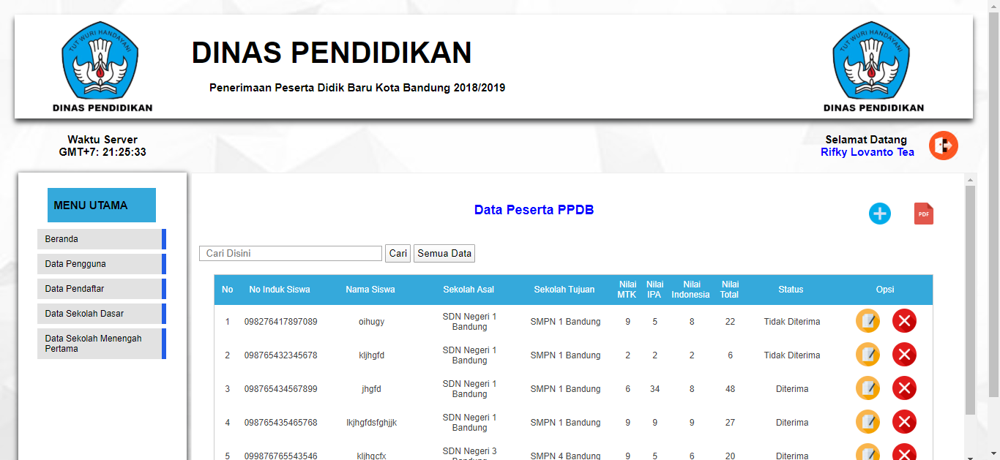

# PPDB SMP Website

## Description
Like in the description, this repo just simple PPDB Website. This one using php 5 for backend and FPDF for handle report. This PPDB website have three access type anonim, user, and admin.

# User Access
1. Anonim
When anonim u can read all post but u can't comment or ask on the blog.

2. User
How to get the user account ?
Just access the register page then, login the account.
For using user page u can create your own account in **phpmyadmin** or you can use this account
> Username : user
> Password : user

3. Admin
Admin can do all user can do and also can manage PPDB website like create data. For using admin page u can create your own account in **phpmyadmin** or you can use this account
> Username : admin
> Password : admin

## How To Run
 1. Download this repo or clone this repo using `git clone https://github.com/lovanto/ppdb-junior-high-school.git`
 2. Move this repo to your localhost dir(xampp, appserv, etc.)
 3. Import file **ppdb.sql** to your phpmyadmin
 4. And then open it on browser [click here](http://localhost/ppdb-junior-high-school) if still default setting

## Notes
Use this program as a reference not for plagiarism.